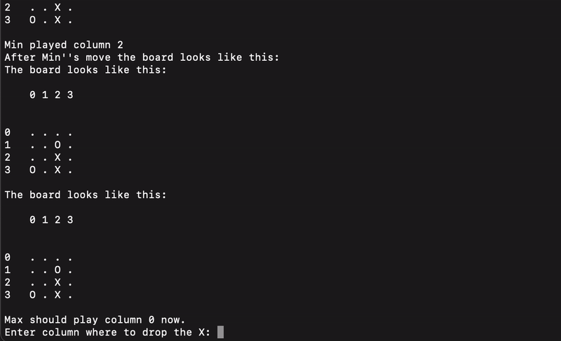

# Connect 4 Python Coursework

## Context

This is a coursework assignment that I completed as part of my Symbolic AI module in my MSc Artificial Intelligence. 
The details of the coursework are described in <em>description.pdf</em>. 
I wrote the program `main.py` from scratch based on the requirements in the `description.pdf` summarized in the section Task.

## Usage

To play the game run `python3 main.py`.

## Task

Write a program in Python that implements adversarial search by Minimax on (m, n, k)-games.
The program will include a class Game with a method `play()` that allows for playing the game, as well as the following:
- A constructor `__init__()`; a method `initialize_game()` to initialize the empty m × n grid at the beginning; and a method `drawboard()` to output the board on the screen.
- At each step the program computes the Minimax strategy for Max and recommend the relevant action(s) to the user.
The user is then prompted to insert the coordinates of the chosen cell.
Finally, the program outputs the move for Min.
Write methods `max()` and `min()` to compute Minimax values for both players, as well as methods `is_valid()` and `is_terminal()` to check for valid moves and terminal states.
